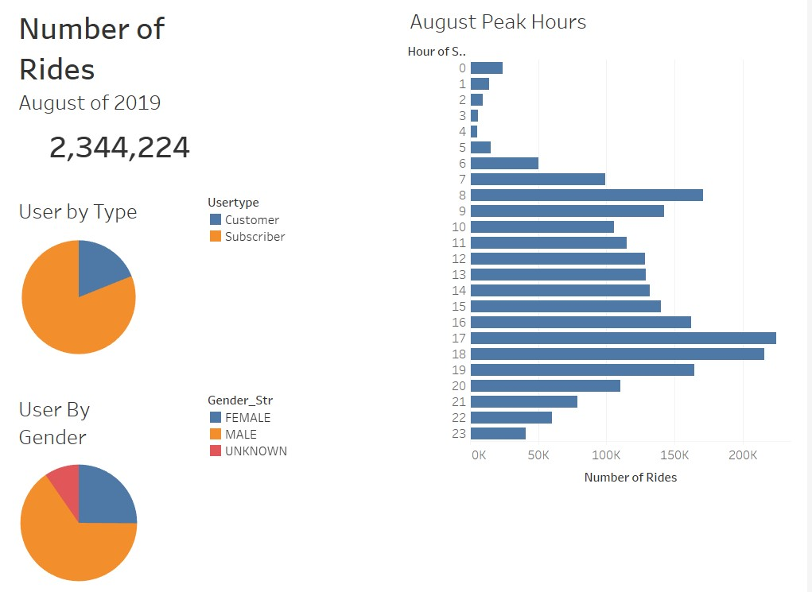
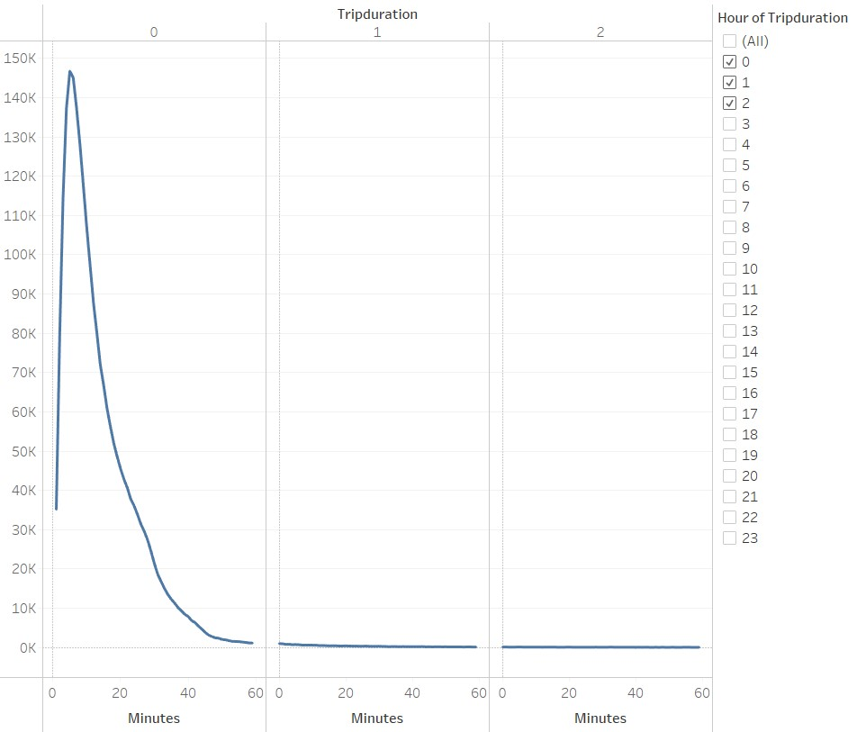
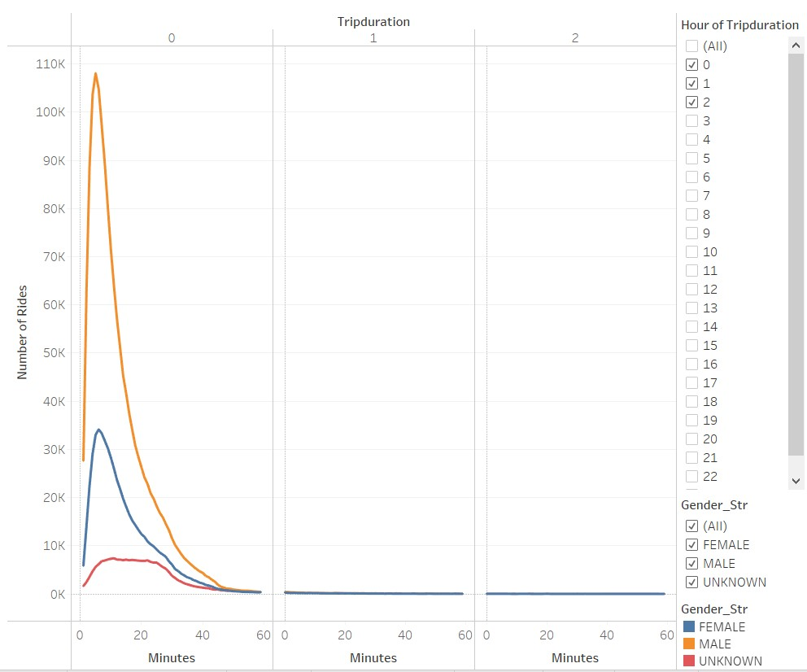
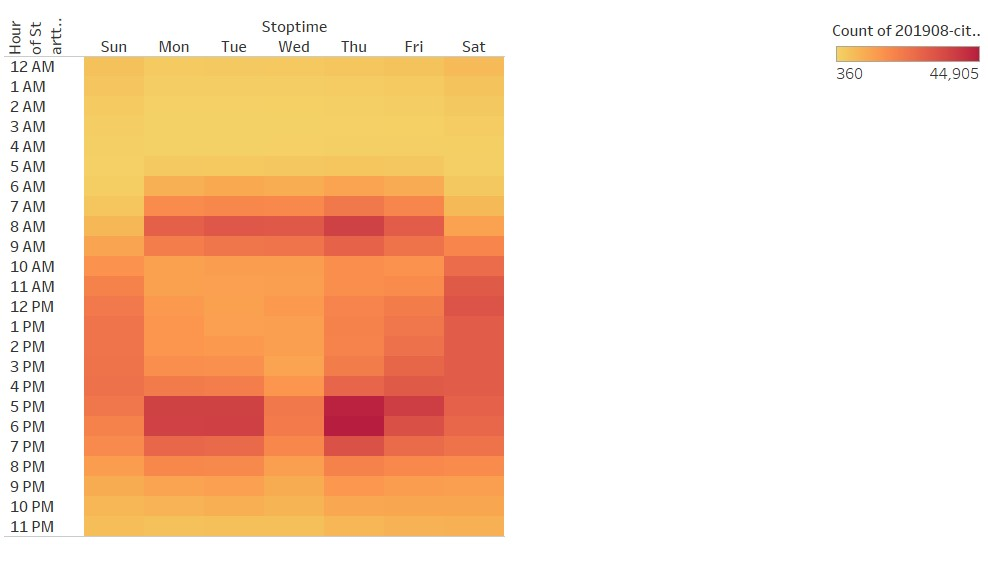
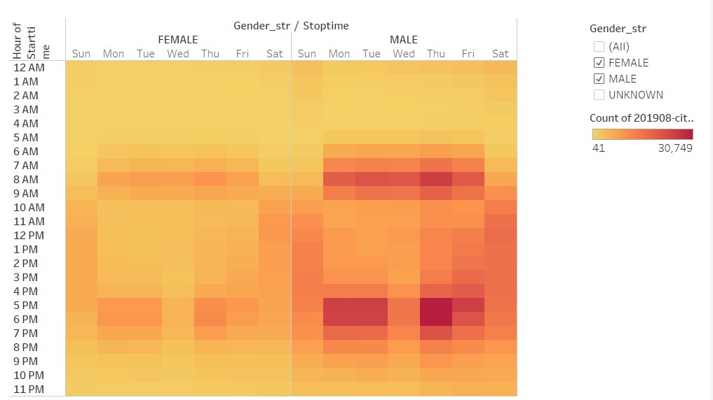
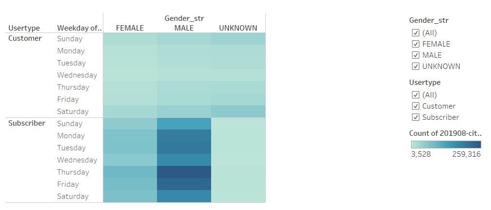
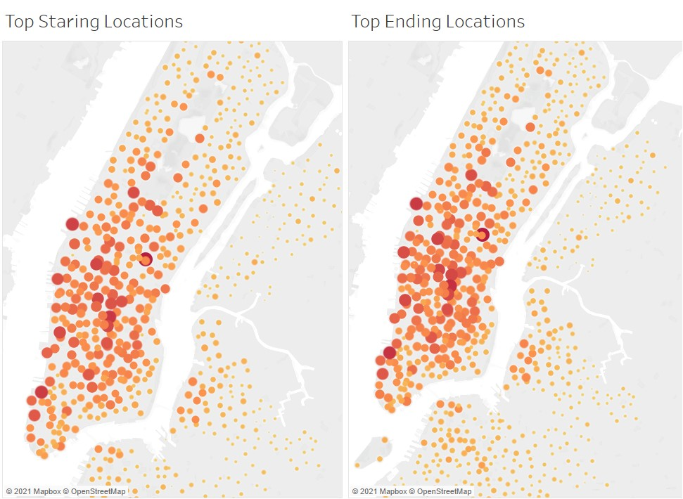
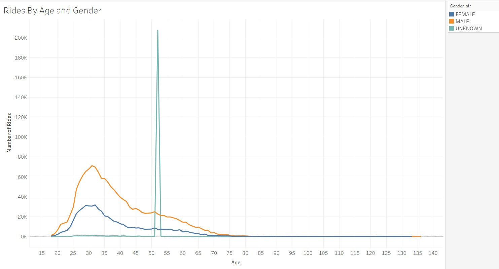

# bikesharing
## Overview of the analysis

The purpose of this project is to provide visualization of NYC bike sharing data using Tableau, with the purpose to help investors and other stake holder make decision on starting a bike sharing service in Des Moines.
________
## Results
The bikeshare service in NYC was used for a total of 2,344,224 rides in the month of August of 2019, most of these rides were made by subscribers and males. Peak usage hours are between 4pm and 7pm.

Most of the trips made are short, with about 91.3% of trips being less than 30 minutes, the bike service in Des Moines should consider a pricing structure that accounts for most trips being short duration.

The breakdown of trips by gender doesn’t show a significant deviation from the general trip duration. But is does shows that a vast majority of trips are perform by males.

The heat map by user shows most concentration of use during commute hours during the weekday, while the weekends have more consistent use throughout the day. It is interesting to note that Wednesdays rides the afternoon rush hour are less than the other weekdays.

As before the breakdown by gender follows the same patter as the overall heatmap.  

Looking at the heatmap for trips by user type and gender we see the segment with most concentrated use the male subscribers. As the rest of the visualizations the use of the services is dominated by males. For our project in Des Moines, we will need to develop strategies to have a more balance use of the service between genders.

 Looking at where most trips start and end in New York City we see most trips cluster in the mid and downtown areas of the city. Being that most users are subscribers, and most rides are made during rush hours we can infer that most trips are being done by commuter to work. We will need to identify which will be the areas in Des Moines with dense concentration of commuting trips can occur to place the bike stations.

____________
## Summary
The complete tableau visualization can be access on tableau public by 
[clicking here.](https://public.tableau.com/views/bikeshare_challange/Story1?:language=en-US&publish=yes&:display_count=n&:origin=viz_share_link)
To further understand the demographics of bikeshare user we can create a line chart to visualize the age of the user. The age can be calculate using the birth year field. Another useful visualization would be segmenting the same chart by gender. 
By doing this visualization we notice an outlier for the unknown gender age 52. With over 200,000 trips we will need to investigate what problems could it be causing to our analysis.

